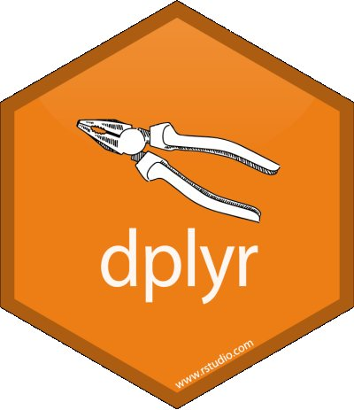
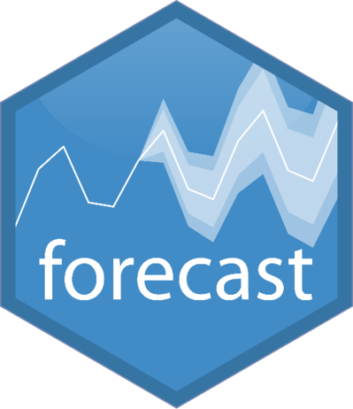

### the Essence of Econometrics

<!---
$$X_i$$

$$X_{i}$$

$$X^2_{i,j}$$

<!---

    

        

            
Data Wrangling

            

                
                dplyr
            

            

                
                purrr
            

        

        

            
Machine Learning

            

                
                forecast
            

            

                
                h2o
            

            

                
                scikit-learn
            

        

        

            
Data Viz/DL

            

                
                qliksense
            

            

                
                tableau
            

        

        

        

--->
